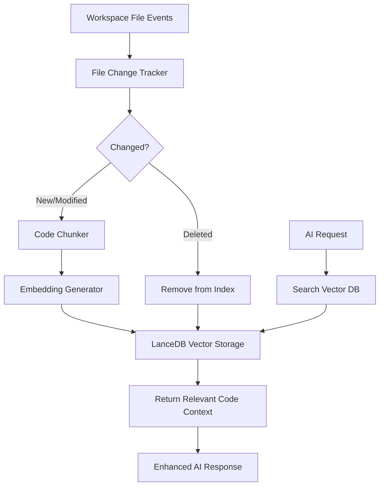

# Code Indexer Implementation Plan

This is a detailed, chronological implementation plan for the code indexer feature, broken down into individual tasks that can be implemented one at a time.

## Overview

The code indexer will consist of three main components:

1. **Tree Sitter Code Chunker** - Parse source code into meaningful chunks
2. **OpenAI Embeddings** - Convert code chunks to vector embeddings
3. **LanceDB Vector Database** - Store and search code embeddings efficiently

## Architecture Diagram

## Chronological Implementation Tasks

### Phase 1: Foundation - Database and Storage

1. **Create Configuration Types and Utilities**

    - Define interface for configuration options
    - Create utility function to get default config
    - Set up path helpers for globalStorage access

2. **Create Path Utility Functions**

    - Implement function to get database path from globalStorage
    - Add helper to ensure database directory exists
    - Create utilities for path normalization and validation

3. **Update LanceDB Path Logic**
    - Modify CodeSearch to use configured database path
    - Add initialization checks for directory existence
    - Implement error handling for path-related issues

### Phase 2: File Change Tracking

4. **Create File Status Interface**

    - Define types to track file status (new, modified, deleted)
    - Implement file status comparison logic
    - Create file hash calculation utility

5. **Implement File Tracker Class**

    - Create base FileTracker class
    - Add methods to add, update, and remove files
    - Implement file status querying functionality

6. **Add Timestamp and Hash Tracking**
    - Extend FileTracker to store timestamps
    - Add hash storage for change detection
    - Implement modified file detection logic

### Phase 3: VSCode Workspace Integration

7. **Create Basic Workspace File Watcher**

    - Set up VSCode workspace file watcher
    - Implement event handlers for file changes
    - Add basic logging for file events

8. **Add File Change Queue**

    - Implement queue for file change events
    - Add debounce logic to prevent excessive processing
    - Create queue processing mechanism

9. **Add Event Prioritization**
    - Implement priority handling for different file events
    - Add throttling to prevent excessive CPU usage
    - Create work batching for efficient processing

### Phase 4: Metadata Management

10. **Create Metadata Storage Interface**

    - Define interface for storing file metadata
    - Implement basic in-memory metadata cache
    - Add methods to query and update metadata

11. **Add Persistence for Metadata**

    - Implement JSON-based metadata persistence
    - Add read/write methods for metadata file
    - Create error handling and recovery logic

12. **Implement Change Detection Logic**
    - Create functions to compare file metadata
    - Add logic to determine which files need indexing
    - Implement modified file detection system

### Phase 5: Indexing Operations

13. **Update Chunker Integration**

    - Modify getChunks for batch processing
    - Add error handling for chunking failures
    - Implement chunk size limits for large files

14. **Extend CodeSearch for Batch Operations**

    - Add batch indexing method for multiple files
    - Implement error handling for batch operations
    - Create progress tracking for batch indexing

15. **Add Delete Operations**
    - Implement file deletion handling in database
    - Add cleanup for removed files
    - Create index consistency checking

### Phase 6: Core Indexer Service

16. **Create Main Indexer Service Class**

    - Implement CodeIndexerService class
    - Add initialization and configuration
    - Create lifecycle management (start/stop)

17. **Add Workspace Scanning**

    - Implement initial workspace scanning logic
    - Add file filtering based on configuration
    - Create progress reporting for initial scan

18. **Implement File Processing Logic**
    - Create logic to process changed files
    - Add worker queue for background processing
    - Implement back-pressure for large workloads

### Phase 7: User Settings and Commands

19. **Add User Settings**

    - Create settings for embedding models
    - Add indexing configuration options
    - Implement settings change handling

20. **Create Basic User Commands**

    - Add command to manually trigger indexing
    - Implement command to view indexing status
    - Create command registration system

21. **Implement Index Management Commands**
    - Add commands to clear the index
    - Create command to rebuild index
    - Implement pause/resume functionality

### Phase 8: Embedding Provider Configuration

22. **Create Embedding Provider Interface**

    - Define interface for embedding providers
    - Implement OpenAI embedding provider
    - Add provider factory function

23. **Implement Provider Configuration**

    - Add settings for embedding providers
    - Create configuration validation
    - Implement fallback options for failures

24. **Add Error Handling and Retries**
    - Implement retry logic for embedding failures
    - Add rate limiting for API calls
    - Create error logging and reporting

### Phase 9: Search and Integration

25. **Implement Basic Search Interface**

    - Create interface for searching code chunks
    - Add methods to search by natural language
    - Implement result formatting functions

26. **Extend Search Capabilities**

    - Add filtering options for search results
    - Implement context expansion for results
    - Create relevance scoring functionality

27. **Create Integration API**
    - Implement API for other components to use
    - Add methods to query indexed data
    - Create response formatting helpers

### Phase 10: Testing and Refinement

28. **Implement Basic Tests**

    - Create unit tests for core components
    - Add integration tests for file tracking
    - Implement test helpers for database mocking

29. **Add Performance Measurements**

    - Create performance benchmarking
    - Implement metrics collection
    - Add reporting for indexing performance

30. **Final Refinements and Documentation**
    - Implement performance optimizations
    - Create comprehensive documentation
    - Add examples and usage guides
